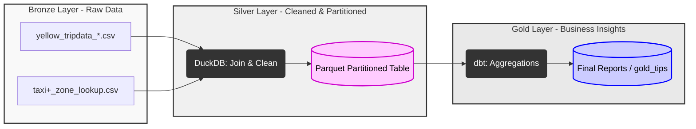

# NYC Taxi Data Processing Pipeline
## Medallion Architecture Implementation

### Overview
This repository contains a data pipeline for processing and analyzing NYC Taxi trip records. The system is built using the Medallion Architecture (Bronze, Silver, Gold) to transform raw CSV data into a structured analytical layer.

### Architecture
The pipeline consists of three logical stages:

1. **Bronze (Raw):** Ingestion of raw CSV files, including trip data and zone lookup tables.
2. **Silver (Refined):** Data cleaning and geographic enrichment. Invalid records (negative amounts, zero distances) are filtered out. Processing is handled by DuckDB, with output stored in partitioned Parquet files.
3. **Gold (Analytics):** Business-level aggregations and reporting models managed via dbt.



### Tecnology Stack
* **Orchestration:** Dagster (Software-Defined Assets)
* **Processing Engine:** DuckDB (Vectorized execution)
* **Transformation Layer:** dbt Core
* **Storage Format:** Apache Parquet

### Technical Implementation
* **Idempotency:** The pipeline uses date-based partitioning. Re-running the process for a specific month overwrites the existing partition, preventing data duplication.
* **Performance:** DuckDB is utilized for vectorized analytical processing. This approach provides high throughput on single-node environments compared to local Spark overhead.
* **Modularity:** The separation of the processing engine (DuckDB) from the transformation layer (dbt) ensures a clean transition between data engineering and data analytics.

### Setup and Execution

**1. Dependency Installation**
Install the required packages using pip:
```bash
pip install -r requirements.txt
```

**2. Pipeline Execution**
Launch the Dagster development server:
```bash
dagster dev -f pipeline.py
```

**3. Data Transformation**
Execute dbt models to build the final tables:
```bash
dbt run --profiles-dir .
```

### Results and Insights
The final analytical layer provides insights into tipping behavior across NYC boroughs:

* **High-Value Zones:** Airport-related zones (EWR, Queens) show the highest average tip amounts due to longer trip distances.
* **Volume Analysis:** Manhattan records the highest transaction volume (over 5.7M trips) but maintains a lower average tip per ride compared to outer-borough long-distance trips.