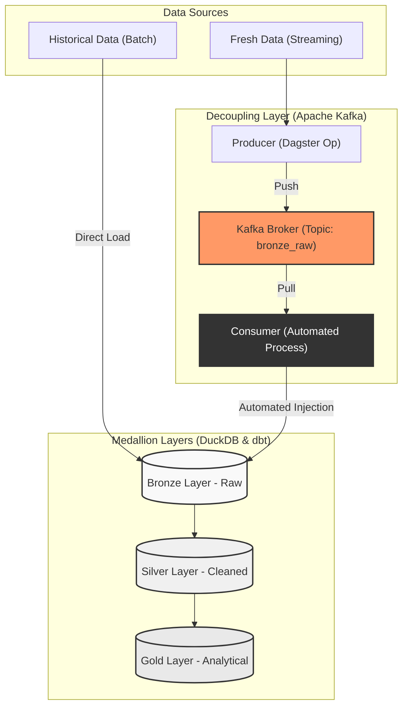

# NYC Taxi Data Processing Pipeline
## Medallion Architecture Implementation

### Overview
This repository contains a robust data pipeline for processing and analyzing NYC Taxi trip records. The system has been extended from a traditional batch-only process to a **hybrid architecture** that supports:
* **Batch Processing**: For large historical datasets (historical ingestion).
* **Streaming Ingestion**: For "fresh" incremental data via Apache Kafka, implementing a decoupling layer to ensure system scalability and stability.

### Architecture
The pipeline consists of three logical stages with an added **Decoupling Layer** for streaming data:

1. **Bronze (Raw):** Ingestion of raw CSV files, including trip data and zone lookup tables.
2. **Silver (Refined):** Data cleaning and geographic enrichment. Invalid records (negative amounts, zero distances) are filtered out. Processing is handled by DuckDB, with output stored in partitioned Parquet files.
3. **Gold (Analytics):** Business-level aggregations and reporting models managed via dbt.



### Technology Stack
* **Orchestration:** Dagster (Software-Defined Assets)
* **Message Broker:** Apache Kafka & Zookeeper (Dockerized)
* **Processing Engine:** DuckDB (Vectorized execution)
* **Transformation Layer:** dbt Core
* **Storage Format:** Apache Parquet
* **Infrastructure:** Docker Compose

### Technical Implementation
* **Idempotency:** The pipeline uses date-based partitioning. Re-running the process for a specific month overwrites the existing partition, preventing data duplication.
* **Performance:** DuckDB is utilized for vectorized analytical processing. This approach provides high throughput on single-node environments compared to local Spark overhead.
* **Modularity:** The separation of the processing engine (DuckDB) from the transformation layer (dbt) ensures a clean transition between data engineering and data analytics.

### New: Streaming & Decoupling
To handle real-time data ingestion, the pipeline now features:
* **Decoupling:** Kafka acts as a buffer between the data source and the storage layer, preventing database locks during high-volume periods.
* **Automated Injection:** A dedicated Consumer process automatically "pulls" records from Kafka and performs an INSERT into the Bronze layer.
* **Dual-Mode:** The pipeline can switch between batch (direct file load) and streaming (Kafka-based) via Dagster configuration.

### Setup and Execution

**1. Infrastructure Setup**
Start the message broker using Docker:
```bash
docker-compose up -d
```

**2. Dependency Installation**
Install the required packages using pip:
```bash
pip install -r requirements.txt
```

**3. Pipeline Execution**
Launch the Dagster development server:
```bash
dagster dev -f pipeline.py
```

**4. Choose Ingestion Mode**
In the Dagster UI (Launchpad), paste the corresponding YAML configuration for your use case:

**Option A: Batch Mode**
```YAML
ops:
  kafka_streaming_ingest:
    config:
      mode: "batch"
  bronze_automated_injection:
    config:
      mode: "batch"
Option B: Streaming Mode (Kafka + Fresh Data)
```

**Option B: Streaming Mode (Kafka + Fresh Data)**
```YAML
ops:
  kafka_streaming_ingest:
    config:
      mode: "streaming"
      new_data_file: "data/raw/yellow_tripdata_small.csv"
  bronze_automated_injection:
    config:
      mode: "streaming"
  silver_taxi_data:
    config:
      mode: "streaming"
```

**5. Data Transformation**
Execute dbt models to build the final tables:
```bash
dbt run --profiles-dir .
```

### Results and Insights
The final analytical layer provides insights into tipping behavior across NYC boroughs:

* **System Decoupling:** Successfully implemented Apache Kafka to separate data ingestion from storage. This ensures system stability and data persistence even during high-volume spikes.
* **Hybrid Efficiency:** The pipeline effectively handles historical batch data for volume and incremental streaming data for freshness, providing a scalable "Lambda-style" architecture.
* **High-Value Zones:** Airport-related trips (JFK, EWR, Queens) consistently show the highest average tips due to longer distances and higher fare totals.
* **Volume vs. Quality:** Manhattan dominates trip volume, but long-distance outer-borough trips yield significantly higher tip-to-fare ratios.
* **Data Integrity:** The Silver layer successfully filters out corrupted raw data (negative fares/zero distances) captured during the automated injection phase.